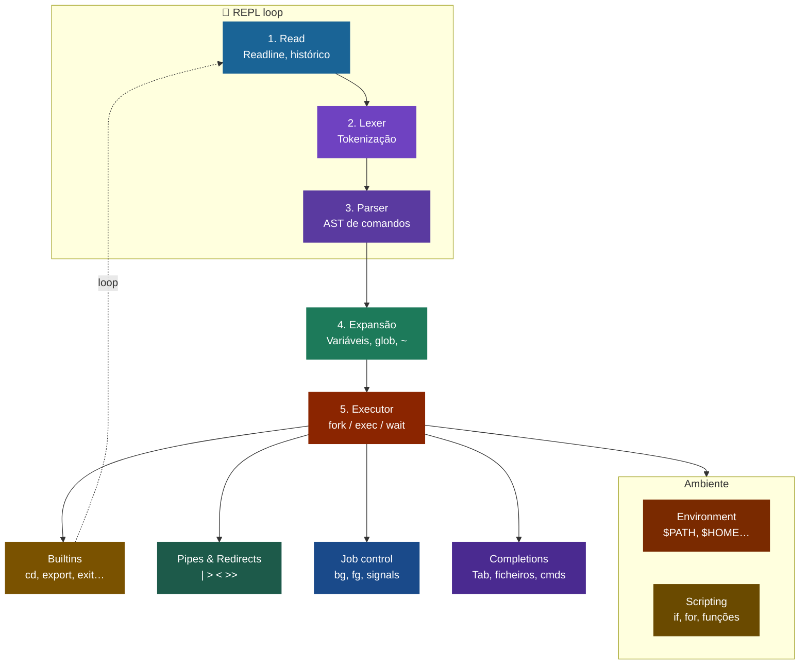

# myshell — Shell completa em OCaml

Shell POSIX-like escrita de raiz em OCaml puro, para fins académicos.  
Cobre todas as funcionalidades de uma shell moderna: parsing completo,
scripting, job control, expansões, readline com histórico e tab completion.

---

## Arquitectura



### Módulos

| Módulo | Responsabilidade |
|--------|-----------------|
| `types.ml` | Tipos centrais: `redirect`, `simple_cmd`, `pipeline`, `ast`, `job` |
| `lexer.ml` | Tokenização, expansão de variáveis, glob, chaves, command substitution |
| `parser.ml` | Parser recursivo descendente → AST |
| `builtins.ml` | Comandos internos + tabela de aliases + resolução de $PATH |
| `executor.ml` | fork/exec, pipes, redirects, avaliação da AST |
| `history.ml` | Histórico persistente em `~/.myshell_history` |
| `prompt.ml` | Prompt dinâmico com cores, branch git, suporte a `$PS1` |
| `completion.ml` | Tab completion: comandos, ficheiros, funções, aliases |
| `readline.ml` | Edição de linha em modo raw: setas, Ctrl+A/E/K/U/W/R, histórico |
| `config.ml` | Carrega `~/.myshellrc` ao arrancar |
| `main.ml` | REPL, modo script, modo `-c`, gestão de sinais |

---

## Funcionalidades

### 1. Execução e análise
- **REPL** completo com prompt colorido
- **Lexer** com aspas simples/duplas, escape `\`, backticks
- **Parser** recursivo descendente → AST tipada
- **Resolução de `$PATH`** — `ls` em vez de `/bin/ls`
- **Modo script**: `myshell script.sh [args]`
- **Modo inline**: `myshell -c "cmd1 && cmd2"`

### 2. Gestão de I/O
- **Pipes**: `cmd1 | cmd2 | cmd3`
- **Redirect saída**: `>`, `>>`
- **Redirect entrada**: `<`
- **Redirect erros**: `2>`, `2>>`, `2>&1`
- **Here-documents**: `cat << EOF ... EOF`

### 3. Gestão de processos
- **Background**: `comando &`
- **Jobs**: `jobs`, `fg [%n]`, `bg [%n]`
- **Sinais**: `kill [-SIGNAL] pid`
- **Wait**: `wait [pid]`

### 4. Expansões
- **Variáveis**: `$VAR`, `${VAR}`, `${VAR:-default}`, `${VAR:+val}`, `${#VAR}`
- **Especiais**: `$?`, `$$`, `$#`, `$@`, `$0`–`$9`
- **Tilde**: `~`, `~/dir`, `~user`
- **Glob**: `*.ml`, `?.txt`, `[a-z]*`
- **Chaves**: `{a,b,c}`, `{1..5}`, `{a..z}`, `pre{A,B}suf`
- **Command substitution**: `$(cmd)`, `` `cmd` ``

### 5. Scripting
- **Condicionais**: `if/elif/else/fi`
- **Loops**: `while/do/done`, `until/do/done`, `for VAR in WORDS; do/done`
- **Case**: `case WORD in pattern) ... ;; esac`
- **Funções**: `function nome { corpo }` ou `nome() { corpo }`
- **Controlo**: `break`, `continue`, `return [n]`
- **Operadores**: `&&`, `||`, `;`
- **Subshell**: `(cmd)`, grupo: `{ cmd; }`

### 6. Builtins

| Comando | Descrição |
|---------|-----------|
| `cd [dir\|-]` | Muda de directório (`-` = anterior) |
| `pwd` | Directório actual |
| `echo [-n] args` | Imprime texto |
| `printf fmt args` | Formata e imprime |
| `export [VAR=val]` | Exporta variável |
| `unset VAR` | Remove variável |
| `local VAR=val` | Variável local (em funções) |
| `readonly VAR` | Variável só de leitura |
| `alias [nome=val]` | Define/lista aliases |
| `unalias [-a] nome` | Remove alias |
| `jobs` | Lista jobs em background |
| `fg [%n]` | Traz job para foreground |
| `bg [%n]` | Retoma job em background |
| `wait [pid]` | Espera por processo |
| `kill [-SIG] pid` | Envia sinal |
| `test` / `[` | Avalia condições |
| `read [-p msg] VAR` | Lê linha para variável |
| `source` / `.` | Executa script no contexto actual |
| `eval cmd` | Avalia string como comando |
| `shift [n]` | Desloca argumentos posicionais |
| `set [-- args]` | Define argumentos posicionais |
| `type cmd` | Mostra tipo de comando |
| `which cmd` | Localiza executável |
| `history` | Mostra histórico |
| `sleep n` | Pausa n segundos |
| `true` / `false` | Retornam 0 / 1 |
| `:` | No-op |
| `exit [n]` | Sai do shell |

### 7. Readline interactivo
- **Edição**: setas ←→, Ctrl+A (início), Ctrl+E (fim)
- **Apagar**: Backspace, Delete, Ctrl+K (até fim), Ctrl+U (linha toda), Ctrl+W (palavra)
- **Histórico**: ↑↓ navegam, Ctrl+R pesquisa incremental
- **Completar**: Tab completa comandos, ficheiros, aliases, funções
- **Multilinhas**: estruturas incompletas pedem continuação com `>`
- **Limpar**: Ctrl+L limpa o ecrã

### 8. Configuração
- **`~/.myshellrc`**: carregado automaticamente ao arrancar
- **`$PS1`**: prompt personalizável com `\u`, `\h`, `\w`, `\$`, `\t`, `\d`, `\n`
- **`$PATH`**: usado para resolver comandos

---

## Instalação

### Requisitos
```
OCaml   >= 4.14
dune    >= 3.0
opam    (recomendado para gerir dependências)
```

### Compilar
```bash
# Clonar/extrair o projecto
cd myshell

# Compilar
dune build

# Testar directamente
./_build/default/bin/main.exe

# Instalar globalmente (opcional)
dune install
```

### Configuração inicial
```bash
cp example.myshellrc ~/.myshellrc
# editar conforme necessário
```

---

## Exemplos

```bash
# Pipes e redirects
ls -la | grep '\.ml' | sort > ficheiros.txt
cat < input.txt | tr a-z A-Z >> output.txt

# Operadores lógicos
mkdir build && cd build && cmake ..
test -f config.h || echo "config.h não existe"

# Expansões
echo "Hoje é $(date +%d/%m/%Y)"
echo {seg,ter,qua,qui,sex}-feira
mkdir projeto_{frontend,backend,db}
for i in {1..5}; do echo "linha $i"; done

# Funções
function saudacao {
  local nome=$1
  echo "Olá, ${nome:-mundo}!"
}
saudacao OCaml

# Scripting
if [ -d "$HOME/documentos" ]; then
  echo "pasta existe"
else
  mkdir -p "$HOME/documentos"
fi

# Here-document
cat << FIM
linha 1
linha 2
FIM

# Job control
sleep 60 &
jobs
fg %1

# Case
case $1 in
  start) echo "a arrancar..." ;;
  stop)  echo "a parar..." ;;
  *)     echo "uso: $0 start|stop" ;;
esac
```

---

## Estrutura de ficheiros

```
myshell/
├── dune-project
├── README.md
├── example.myshellrc
├── lib/
│   ├── dune
│   ├── types.ml        ← tipos da AST
│   ├── lexer.ml        ← tokenizador + todas as expansões
│   ├── parser.ml       ← parser recursivo descendente
│   ├── builtins.ml     ← comandos internos
│   ├── executor.ml     ← motor de execução (fork/exec/pipes)
│   ├── history.ml      ← histórico persistente
│   ├── prompt.ml       ← prompt dinâmico
│   ├── completion.ml   ← tab completion
│   ├── readline.ml     ← edição de linha em modo raw
│   └── config.ml       ← carregador de .myshellrc
└── bin/
    ├── dune
    └── main.ml         ← REPL, modo script, sinais
```

---

## Decisões de design notáveis

### Por que OCaml?
Os tipos algébricos (`type ast = Pipeline | If | While | ...`) tornam o
pattern matching no executor exaustivo e seguro em tempo de compilação.
Um caso novo na AST que não seja tratado no `eval` produz um aviso do
compilador — impossível de conseguir em C ou Python sem disciplina extra.

### Dependência circular builtins ↔ executor
`builtin_source` precisa de avaliar ASTs → precisa do executor.  
`executor` precisa dos builtins para resolver comandos.  
Solução: `Builtins.eval_ref` é uma `ref` inicializada a `fun _ -> 0`
e preenchida por `executor.ml` com `let () = Builtins.eval_ref := eval`.

### Modo raw do terminal
O readline próprio entra em modo raw (`c_icanon = false`, `c_echo = false`)
para receber cada tecla individualmente. O modo cooked é restaurado antes
de cada `fork/exec` para que os processos filhos tenham um terminal normal.

### Pipes
Para `A | B | C` cria-se um array de `n-1` pipes Unix. Cada filho
recebe o read-end do pipe anterior e o write-end do seguinte. O pai
fecha **todos** os descritores — crítico para que os leitores recebam
EOF quando o escritor termina.

---
T
